### 访问chatgpt教程 

#### 目录

* [chatgpt账号](https://www.x-sms.cn/accounts)
* [搭建梯子](#搭建梯子)
* [使用梯子](#使用梯子)


#### 搭建梯子

> 为什么要单独购买服务器，因为网上的vpn大部分都是多人共用的，访问chatgpt会造成ip限流问题

##### 购买服务器

* 购买一台服务器，这里推荐使用vultr，稳定的1批 同时也便宜的很 [点击注册](https://www.vultr.com/?ref=9381725)
先注册一个账号, 如果QQ邮箱无法收到邮件，可以使用 outlook / skiff 邮箱等国外邮箱注册, 或者临时邮箱，
推荐一个[临时邮箱地址](https://temp-mail.org/en/), (QQ太辣鸡了，屏蔽了) 

* 注册好了以后，登录进去，点击左边的 Billing ，先冲点钱，如图所示，使用支付宝付款就行了，10美金大概70块钱不到，可以用2个多月
* vultr 的是按量付费，创建服务器，关了就不会扣钱

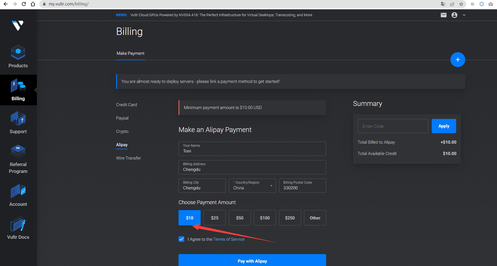

* 然后 点击左侧的 [deploy server 购买一台服务器 ](https://my.vultr.com/deploy/) 

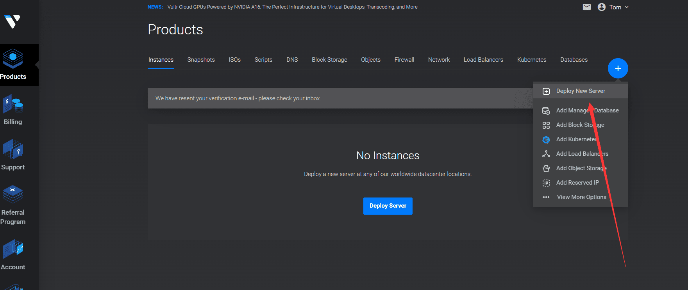

* 选择cpu类型，这里选择最便宜的  `Cloud Compute + AMD High Performance`

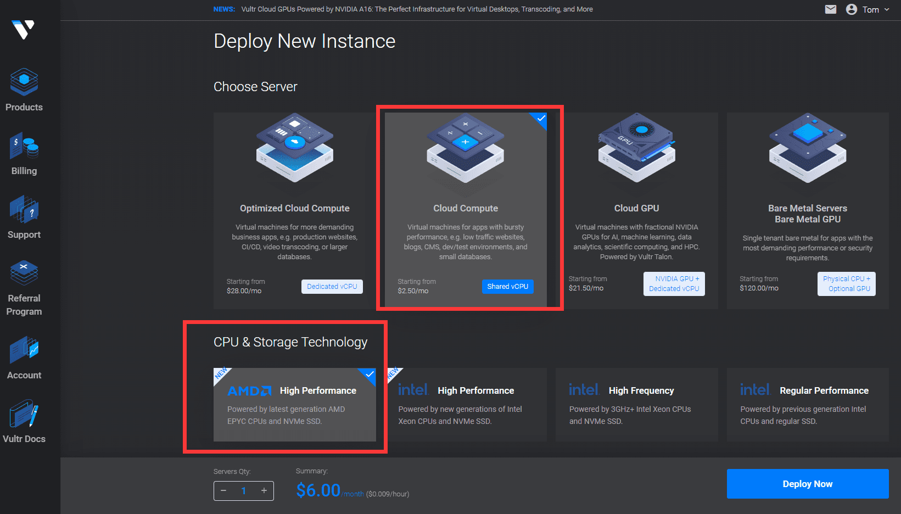

* 地区选择亚洲的就行，我这里选择的是日本

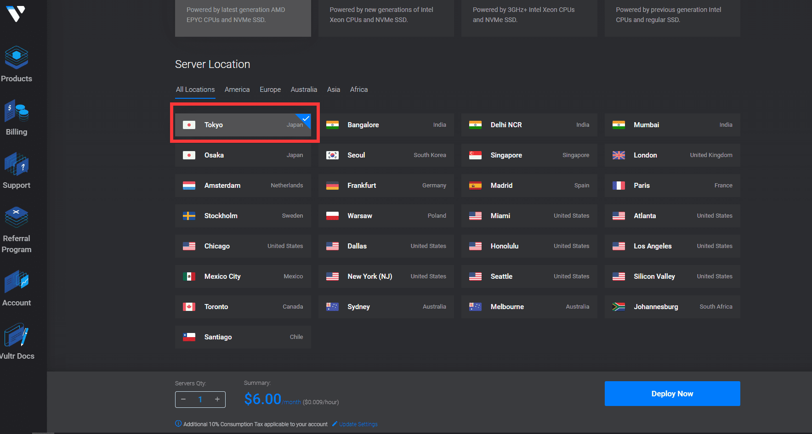

* 操作系统，选择 Ubuntu 20.04 

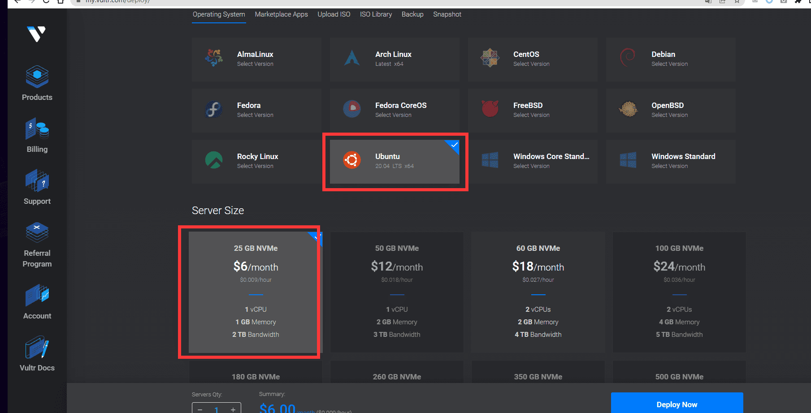


* 自动备份关闭掉 不然每个月1.2美金 点击deploy 就ok了

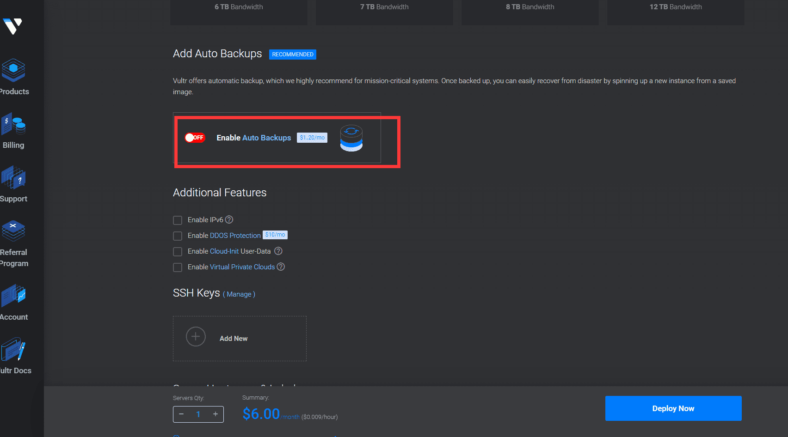

* 等几分钟，就安装完成了，点击进入详情，可以看到 ip 地址什么的. 

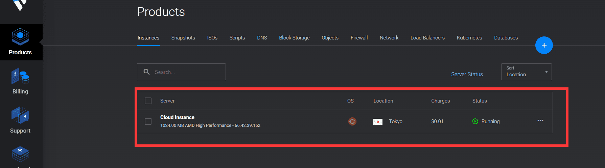

###### 安装梯子 


* 命令行工具: 
  * 使用 windows 的power shell 
  * 或者下载 [windows terimal](https://apps.microsoft.com/store/detail/windows-terminal/9N0DX20HK701?hl=en-us&gl=us) , 
  * 或者使用 xshell 也行，自行百度下载. 

* 进入服务器后台，打开服务器的 22 , 443 端口 点击 Products -> FireWall -> [AddFireWall Group](https://my.vultr.com/firewall/add/) 
* 名字随便填写, 开启 22, 443 端口

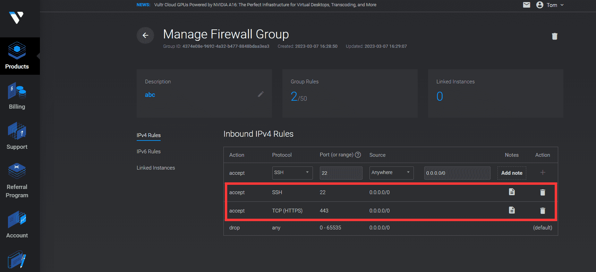

* 进入服务器后台，设置 -> 防火墙 , 将刚刚添加的防火墙绑定到机器上.

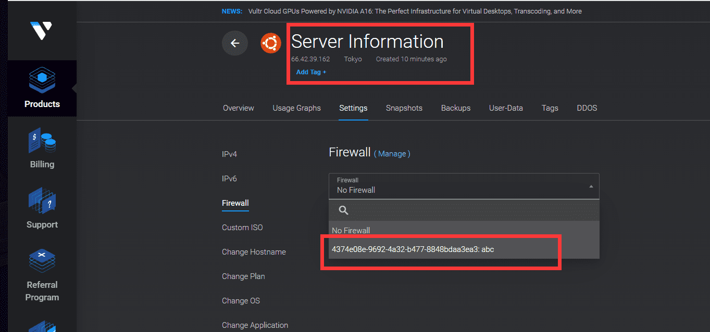


* 用命令行登录服务器
* 先执行下面的代码，关闭机器防火墙
```shell

ufw disable

```

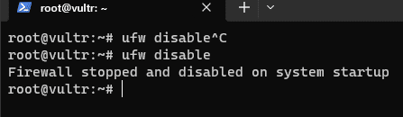

* 安装梯子 , 复制以下代码执行

```shell 
bash <(curl -s -L https://git.io/v2ray.sh)
```
弹出提示，按照下面选择：
```
第一步：输入 1 选择安装  <回车>
第二步: 输入 3 选择 WebSocket <回车> 
第三步: 输入 443  <回车>
第四步: 输入 N  不屏蔽广告 <回车>
第五步：输入 N 不配置 Shadowsocks <回车> 
第六步：回车，安装  
---
等待安装完成. 
```

* 获取安装地址: 
```
输入 v2ray url 回车 
```

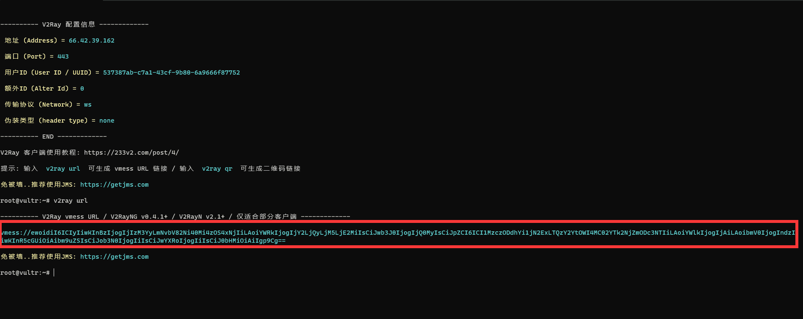

拷贝这串 `vmess://` 开头的地址

#### 使用梯子

1. 下载软件 > [https://wwxb.lanzoul.com/i1AvI0pkcqfe](https://wwxb.lanzoul.com/i1AvI0pkcqfe)
2. 打开 `v2rayN.exe`, 然后 `ctrl + v` 黏贴 `vmess` 地址, 就能访问 chatgpt 了

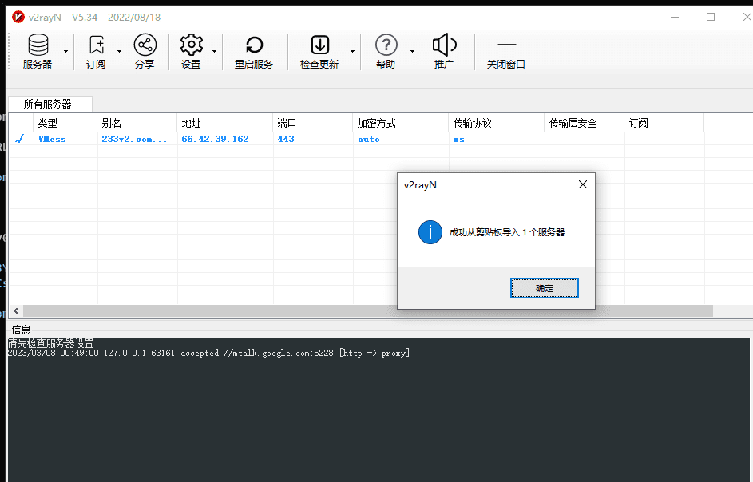

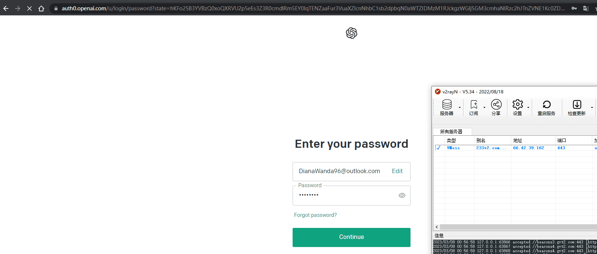
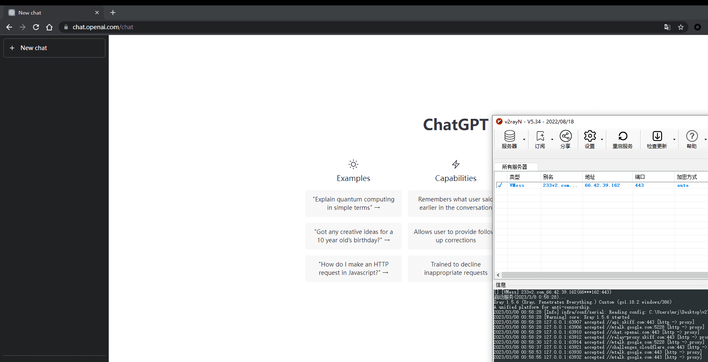

